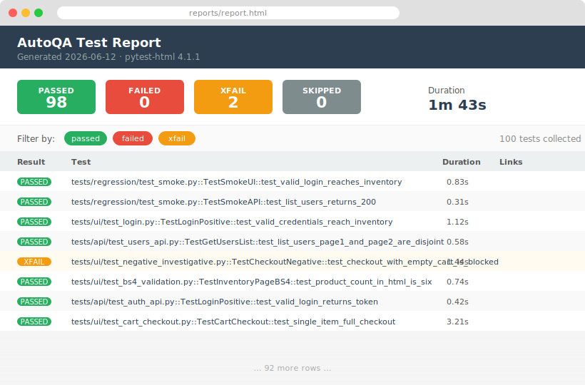

# AutoQA - Python QA Automation Framework

AutoQA is a full-stack QA automation framework built to demonstrate production-grade test engineering across the UI, API, and data-validation layers. It drives [SauceDemo](https://www.saucedemo.com) through Selenium with a Page Object Model, validates REST endpoints against [reqres.in](https://reqres.in) with a thin `requests` wrapper, and applies a secondary BeautifulSoup4 parsing pass to assert on rendered HTML structure - catching layout regressions that Selenium alone misses. Tests are organised by marker (`smoke`, `regression`, `ui`, `api`, `slow`) so the same suite can act as a commit gate in under two minutes or as an overnight regression run covering all 100+ scenarios.

---

## Stack

| Layer | Technology | Version |
|---|---|---|
| Test runner | pytest | 8.3.4 |
| UI automation | Selenium WebDriver | 4.25.0 |
| Driver management | webdriver-manager | 4.0.2 |
| HTML parsing | BeautifulSoup4 | 4.12.3 |
| REST API testing | requests | 2.32.3 |
| Parallel execution | pytest-xdist | 3.6.1 |
| HTML reports | pytest-html | 4.1.1 |
| Environment config | python-dotenv | 1.0.1 |
| CI/CD | GitHub Actions | - |
| Containerisation | Docker (headless Chrome) | - |

---

## Project layout

```
AutoQA/
├── pages/                    # Page Object Model
│   ├── base_page.py          #   waits, scrolls, cookie helpers
│   ├── login_page.py
│   ├── inventory_page.py
│   ├── cart_page.py
│   ├── checkout_page.py
│   └── dynamic_loading_page.py
├── tests/
│   ├── ui/                   # Selenium browser tests
│   │   ├── test_login.py
│   │   ├── test_cart_checkout.py
│   │   ├── test_cookies_session.py
│   │   ├── test_dynamic_loading.py
│   │   ├── test_negative_investigative.py
│   │   └── test_bs4_validation.py
│   ├── api/                  # requests REST tests
│   │   ├── test_users_api.py
│   │   └── test_auth_api.py
│   └── regression/
│       └── test_smoke.py     # 24-test cross-layer smoke suite
├── utils/
│   ├── api_client.py         # thin requests wrapper + assertion helpers
│   └── parsing.py            # BeautifulSoup4 assertion library
├── postman/
│   └── AutoQA.postman_collection.json
├── .github/workflows/
│   └── tests.yml             # push / PR / daily cron pipeline
├── Dockerfile
├── conftest.py               # fixtures: driver, authenticated_driver, base_url …
├── pytest.ini
└── requirements.txt
```

---

## Setup

**Prerequisites:** Python 3.11+, Google Chrome installed locally (for UI tests).

```bash
# 1. Clone
git clone https://github.com/shashwat-tiwari/AutoQA.git
cd AutoQA

# 2. Create and activate a virtual environment
python3 -m venv .venv
source .venv/bin/activate          # Windows: .venv\Scripts\activate

# 3. Install dependencies
pip install -r requirements.txt
```

`webdriver-manager` downloads the matching ChromeDriver automatically on first run - no manual driver installation needed.

---

## Running tests

### Run everything

```bash
pytest
```

### Run by marker

```bash
# Fast smoke gate - all system surfaces, under 2 min
pytest -m smoke

# Full regression suite - all layers
pytest -m regression

# UI tests only (Selenium)
pytest -m ui

# API tests only - run in parallel
pytest -m api -n auto

# Deliberately slow tests (dynamic loading, delay endpoints)
pytest -m slow
```

### Headless mode (suppress the browser window)

```bash
pytest --headless
```

`CI=true` in the environment triggers headless mode automatically - no flag needed in GitHub Actions or Docker.

### Generate an HTML report

```bash
pytest --html=reports/report.html --self-contained-html
# open reports/report.html in any browser
```

---

## Running in Docker

Containerised for portable execution; deployable to Azure Container Instances.

```bash
# Build the image
docker build -t autoqa .

# Run all tests - reports land on the host via volume mount
docker run --rm -v "$(pwd)/reports:/app/reports" autoqa

# Run only the smoke suite
docker run --rm -v "$(pwd)/reports:/app/reports" autoqa -m smoke

# Run API tests in parallel
docker run --rm -v "$(pwd)/reports:/app/reports" autoqa -m api -n auto

# List collected tests without executing
docker run --rm autoqa --collect-only -q
```

The image sets `CI=true`, so Chrome runs headless automatically. The `--no-sandbox` and `--disable-dev-shm-usage` flags required inside a container are passed via `ChromeOptions` in `conftest.py`.

**Azure Container Instances** - the image can be pushed to Azure Container Registry and scheduled as an ACI job:

```bash
az acr build --registry <registry> --image autoqa:latest .
az container create \
  --resource-group rg-autoqa \
  --name autoqa-run \
  --image <registry>.azurecr.io/autoqa:latest \
  --restart-policy Never \
  --environment-variables CI=true
```

---

## CI/CD - GitHub Actions

`.github/workflows/tests.yml` runs on every push, every pull request to `main`, and on a daily cron at 06:00 UTC.

| Job | Marker | Notes |
|---|---|---|
| `api-tests` | `api` | Runs with `-n auto` (pytest-xdist) |
| `ui-tests` | `ui and not slow` | Headless Chrome; sequential |
| `regression` | `smoke` on push/PR · `regression` on cron | Always runs even if upstream jobs fail |

Both an **HTML report** and a **JUnit XML** are uploaded as artifacts on every run. The JUnit file enables GitHub's native test annotation UI - failed test names appear inline on the PR diff.

**Manual trigger** - use `workflow_dispatch` from the Actions tab to select any marker and traceback verbosity level.

---

## Postman collection

`postman/AutoQA.postman_collection.json` mirrors the full API test suite. Import it into Postman or run headlessly with Newman:

```bash
npm install -g newman
newman run postman/AutoQA.postman_collection.json
```

The collection uses a pre-request script to auto-fetch an auth token before authenticated requests, so it can run in any order.

---

## Test Strategy

### Coverage scope

The suite covers three distinct testing layers that together give confidence at different levels of abstraction:

| Layer | File(s) | Tests |
|---|---|---|
| UI - happy path | `test_login.py`, `test_cart_checkout.py` | 30 |
| UI - negative / investigative | `test_negative_investigative.py` | 43 |
| UI - session & cookies | `test_cookies_session.py` | 12 |
| UI - dynamic content & scroll | `test_dynamic_loading.py` | 11 |
| UI + BS4 - HTML structure | `test_bs4_validation.py` | 40 |
| API - users CRUD | `test_users_api.py` | 61 |
| API - auth flows | `test_auth_api.py` | 43 |
| Cross-layer smoke | `test_smoke.py` | 24 |

### Positive vs negative testing

**Positive tests** walk the intended user journeys end-to-end: a standard login reaches the inventory, all six products render, a cart-to-confirmation checkout completes with correct price arithmetic (`pytest.approx` for floating-point tolerance), and API endpoints return the documented schemas with correct field types.

**Negative and investigative tests** probe the boundary between expected and undefined behaviour. Login attempts use whitespace-only strings, 500-character inputs, special characters, Unicode, XSS payloads, and emoji to determine what the application accepts or rejects. Checkout form fields receive alphabetic postal codes, SQL injection strings, and newline characters. Two tests are marked `xfail` - they document a known gap (SauceDemo does not block checkout from an empty cart) without breaking CI, turning a missing guard into a tracked artefact rather than a silent hole.

### UI vs API

UI tests use Selenium with a Page Object Model. Each page class owns its locators and interaction methods; tests call high-level actions (`login()`, `add_item_by_name()`) rather than raw WebDriver calls. A secondary BeautifulSoup4 pass runs on `driver.page_source` after Selenium renders the page, asserting on HTML structure (correct product node count, price formatting, form field attributes) independently of JavaScript state - this catches regressions that only appear in the static markup.

API tests use a thin `requests` wrapper with domain-specific assertion helpers (`assert_schema`, `assert_echoed_fields`, `assert_response_time`, `assert_json_value` with dot-notation key paths). Every endpoint is tested for status code, content type, response time, field types, and semantic correctness (e.g. paginated pages are disjoint, `total_pages == ceil(total/per_page)`). Negative API cases cover null payloads, missing required fields, non-integer path parameters, and invalid endpoints.

### Regression approach

Tests are tagged with a `regression` marker rather than living in a single directory. Running `pytest -m regression` selects the full production-quality suite across all layers. The `smoke` marker selects a strict 24-test subset (8 UI, 6 BS4, 10 API) that must pass in under two minutes and covers every system surface at least once - suitable as a commit gate or post-deploy canary check.

`@pytest.mark.slow` tests - deliberate delay endpoints and dynamic-loading animations - are excluded from the default `ui` run and the smoke suite. They run on the daily cron alongside the full regression suite, where wall-clock time is less critical and any new flakiness is surfaced before it reaches a developer's feedback loop.

---

## Sample HTML report

`pytest-html` generates `reports/report.html` after every run. It includes per-test duration, captured logs, and expandable failure tracebacks.



---

## Environment variables

| Variable | Default | Purpose |
|---|---|---|
| `BASE_URL` | `https://www.saucedemo.com` | SauceDemo target |
| `API_BASE_URL` | `https://reqres.in/api` | REST API target |
| `INTERNET_BASE_URL` | `https://the-internet.herokuapp.com` | Dynamic loading tests |
| `REQRES_API_KEY` | _(required for API tests)_ | reqres.in API key — get a free one at [app.reqres.in/api-keys](https://app.reqres.in/api-keys) |
| `CI` | _(unset)_ | `true` enables headless Chrome |

Override with a `.env` file at the project root (loaded automatically by `python-dotenv`) or as shell / CI environment variables.

For local runs, create `.env`:
```
REQRES_API_KEY=your_key_here
```

For GitHub Actions, add `REQRES_API_KEY` as a repository secret: **Settings → Secrets and variables → Actions → New repository secret**.

---

## Author

Shashwat Tiwari · [tiwari.sha@northeastern.edu](mailto:tiwari.sha@northeastern.edu)
